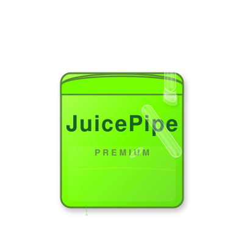

# MixMind

**AI-assisted mixing plugin by JuicePipe. VST3 / AU / Standalone.**

<p align="center">
  
</p>

MixMind is a utility audio plugin that analyzes your mix in real time and delivers context-aware recommendations through a conversational interface. It runs as a standard DAW plugin with no audio output — it listens, processes, and advises.

---

## Architecture

```
DAW (Ableton / Logic / Pro Tools / Reaper)
    |
    |--- MixMind.vst3 / .component
    |       |
    |       |-- AudioAnalyzer    Real-time FFT, LUFS, spectral bands
    |       |-- ApiClient        Sends analysis to JuicePipe proxy
    |       |-- ChatComponent    Conversational UI in the DAW
    |       |-- ContextPanel     DAW transport info (BPM, time sig)
    |
    |--- JuicePipe Proxy (Node.js)
            |
            |-- POST /api/chat   Routes to Claude (Premium) or Groq (Standard)
            |-- POST /validate   License key validation
            |-- POST /admin/*    License generation / revocation
```

---

## Features

### DSP Engine (AudioAnalyzer)
- Real-time FFT analysis (2048-point, 11th order Hann window)
- Spectral energy bands: Bass (20-250 Hz), Mid (250-2000 Hz), High (2000+ Hz)
- LUFS integrated loudness and true-peak tracking
- Stereo width estimation (mid/side ratio)
- Crest factor (dynamic range indicator)
- Bass-to-mid ratio (mud detector)
- Clipping detection
- EWMA smoothing for stable readings

### AI Backend (JuicePipe Proxy)
- Tiered model routing: Claude Sonnet (Premium) or Groq/Llama (Standard)
- License key management with JSON-based store
- Per-IP rate limiting (60 req/min)
- Request timeout handling (30s)
- Health check endpoints: `/health` and `/healthz`

---

## Getting Started

### Prerequisites

| Tool | Minimum Version |
|------|----------------|
| CMake | 3.22 |
| JUCE | 8.x (fetched automatically) |
| Xcode (macOS) | 15+ |
| Node.js (proxy) | 18+ |

### Build the Plugin

```bash
git clone https://github.com/kylerobertschuster/mixmind.git
cd mixmind

# JUCE is downloaded automatically — no manual clone needed
cmake -B build -DCMAKE_BUILD_TYPE=Release
cmake --build build --target MixMind_All --config Release
```

The built plugins will be in `build/MixMind_artefacts/Release/`.

### Run the Proxy

```bash
cd proxy
cp env.example .env
# Edit .env with your API keys
npm install
node server.js
```

### Package for Distribution

```bash
# Build + package (unsigned)
./build_pkg.sh

# Build + sign + package
MIXMIND_SIGN_IDENTITY="Developer ID Application: Your Name (TEAMID)" ./build_pkg.sh

# Build + sign + notarize + package
MIXMIND_SIGN_IDENTITY="..." MIXMIND_NOTARIZE=true ./build_pkg.sh
```

---

## Project Structure

```
mixmind/
├── assets/                  Brand assets (logo, icon)
│   ├── logo.svg             Full JuicePipe logo
│   └── icon.svg             Simplified plugin icon
├── Source/                  C++ plugin source
│   ├── PluginProcessor.*    AudioProcessor entry point
│   ├── PluginEditor.*       Editor UI (860x580)
│   ├── AudioAnalyzer.*      Real-time FFT / spectral analysis
│   ├── ApiClient.*          HTTP client for JuicePipe proxy
│   ├── ChatComponent.*      AI chat interface with message bubbles
│   ├── ContextPanel.*       DAW transport display (BPM, time sig)
│   └── LookAndFeel.h        Custom Pro UI theme
├── proxy/                   Node.js backend
│   ├── server.js            Express API server
│   ├── package.json         Dependencies
│   └── env.example          Environment template
├── CMakeLists.txt           Build configuration (FetchContent JUCE)
├── build_pkg.sh             Build + sign + notarize + package
└── README.md
```

---

## License Management

The proxy includes a built-in licensing system:

```bash
# Generate a license (standard tier)
curl -X POST http://localhost:3000/admin/generate-license \
  -H "x-admin-secret: YOUR_SECRET" \
  -H "Content-Type: application/json" \
  -d '{"tier": "standard", "count": 1}'

# Premium tier
curl -X POST http://localhost:3000/admin/generate-license \
  -H "x-admin-secret: YOUR_SECRET" \
  -H "Content-Type: application/json" \
  -d '{"tier": "premium", "count": 1}'
```

---

## Project Status

- DSP engine: production-ready
- AI integration: production-ready (Claude + Groq)
- Chat UI: complete with message bubbles, thinking indicators
- DAW transport sync: BPM, time signature, playback state
- Configuration: environment-based, no hardcoded credentials
- Build: zero-dependency CMake with FetchContent
- Distribution: codesigning + notarization pipeline ready

---

*Built by JuicePipe.*
